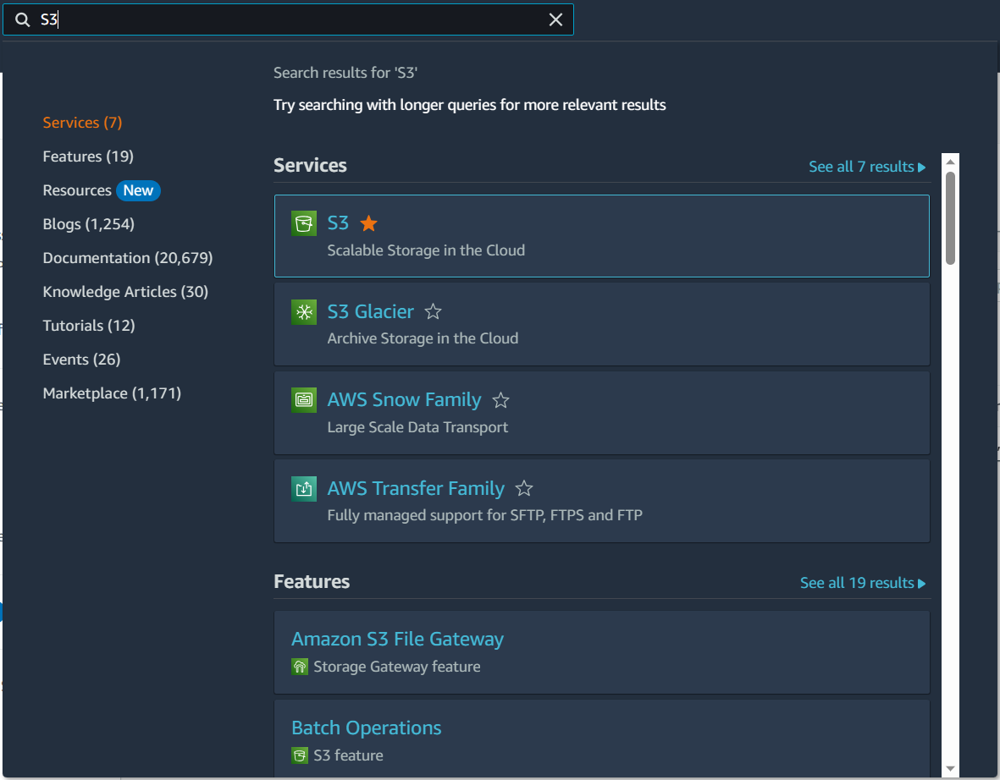

# Setup AWS S3 - Gitlab CI/CD

Created time: June 18, 2023 9:49 PM
Last edited time: June 21, 2023 11:01 AM
Owner: Phương Hữu

> This document provides a step-by-step guide to setting up AWS S3 for Gitlab CI/CD. It covers creating a bucket, setting up static web hosting, permissions, and credentials, building and adding the project to S3, and setting up Gitlab CI/CD with a .gitlab-ci.yml file. The guide includes screenshots and code snippets for each step.
> 

# Prerequisities

1. AWS Account
2. Gitlab Account

# Setup AWS S3

## Search for S3 Storage

After logging in AWS, you’ll see a search bar on top left corner. In here, you’ll type s3 and choose the S3 like in the image below



S3 Result

## Create a bucket

A dashboard will show up and you’ll see a form with create bucket button, click on that


Create your bucket

## General configuration

After clicking Create Bucket, it’ll lead you to the General Configuration


Set up Bucket name and AWS Region

- Bucket name: aws-s3-kfresh
- AWS Region: ap-southeast-2


Set up Object Ownership

<aside>
💡 Control ownership of objects written to this bucket from other AWS accounts and the use of access control lists (ACLs). Object ownership determines who can specify access to objects.

</aside>


Set up Bucket Versioning

<aside>
💡 Versioning is a means of keeping multiple variants of an object in the same bucket. You can use versioning to preserve, retrieve, and restore every version of every object stored in your Amazon S3 bucket. With versioning, you can easily recover from both unintended user actions and application failures.

</aside>


Set up Default Encryption

<aside>
💡 Server-side encryption is automatically applied to new objects stored in this bucket.

</aside>

## Set up static website hosting


Set up static web hosting

- This will let you choose the default html file you’ll use in S3

## Set up public access


Set up permission

- Here I’ll disable public access, in order to test the website.

## Set up Bucket Policy

```json
{
    "Version": "2012-10-17",
    "Statement": [
        {
            "Sid": "PublicReadGetObject",
            "Effect": "Allow",
            "Principal": "*",
            "Action": "s3:GetObject",
            "Resource": "arn:aws:s3:::aws-s3-kfresh/*"
        }
    ]
}
```

<aside>
💡 The bucket policy, written in JSON, provides access to the objects stored in the bucket. Bucket policies don't apply to objects owned by other accounts.

</aside>

## Search for IAM

In the search bar, search for IAM, then it’ll lead you to dashboard


IAM Result

## Add new provider

Next, add a new provider to grant the user identifies permission to use AWS resources


## Create IAM Policy

After that, create new policy in IAM. The IAM policies define **permissions** for an action regardless of the method that you use to perform the operation.

```json
{
  "Version": "2012-10-17",
  "Statement": [
    {
      "Effect": "Allow",
      "Action": ["s3:ListBucket"],
      "Resource": ["arn:aws:s3:::aws-s3-kfresh"]
    },
    {
      "Effect": "Allow",
      "Action": [
        "s3:PutObject",
        "s3:GetObject",
        "s3:DeleteObject"
      ],
      "Resource": ["arn:aws:s3:::aws-s3-kfresh/*"]
    }
  ]
}
```

## Create new role

Then create new role. An IAM role is **an IAM identity** that you can create in your account that has specific permissions


Select trusted entity

## Create new user

Then create a new User. The IAM user represents the human user or workload who uses the IAM user to interact with AWS


Specify user name


Specify user permission

Finally, create Access Key, this key will be used to access Gitlab CI/CD

- After creating, It’ll let you download .csv which contains:
    1. Access Key ID
    2. Secret Access Key


## Build Project & Add to S3

First, you need to build project in order to get what’s inside that project and throw into your S3 Bucket

Here I’ll use npm run build in order to build my project

```bash
npm run build
```

Next, I will copy my built project & paste it in S3 Bucket


In the Bucket properties, you’ll find your address, use it to open your website

My website will be: [http://aws-s3-kfresh.s3-website-ap-southeast-2.amazonaws.com/](http://aws-s3-kfresh.s3-website-ap-southeast-2.amazonaws.com/)


Here’s the location of your website url, it’s located in Amazon S3 > Buckets > {Your Bucket Name}

And this is the result


# Setup Gitlab CI/CD

## Create a Variables

1. In your gitlab project, Go to Settings > CI/CD
2. In Variables section, click Expand
3. Then type your Variable Name and value
4. I will store:
    1. Access Key ID
    2. Secret Access key
    3. Bucket Name
    4. Region (optional)


## Set up Gitlab Runner

1. Create a folder in your system, ex: `C:\Gitlab-Runner`
2. Download the binary for [64-bit](https://gitlab-runner-downloads.s3.amazonaws.com/latest/binaries/gitlab-runner-windows-amd64.exe) and put it in the folder you just created
3. Rename the file to gitlab-runner.exe
4. Restrict permission


1. Register a runner
    1. Run the following command in your PowerShell or any of your elevated command prompt
        
        ```html
        .\gitlab-runner.exe register
        ```
        
    2. Enter your Gitlab instance URL
    3. Enter a description (optional)
    4. Enter tag (optional)
    5. Enter optional maintenance (optional)
    6. Provide runner executor, I will use `shell`, you can use Docker or anything that suits you
2. Install binary
    
    ```html
    .\gitlab-runner.exe install
    ```
    
3. Start your runner service
    
    ```html
    .\gitlab-runner.exe start
    ```
    

## Config .gitlab-ci.yml

1. Write a .gitlab-ci.yml in your project
    
    A complete YAML file Example:
    
    ```yaml
    stages:
      - build
      - deploy
    
    # Building before deploy
    build artifact:
      stage: build
      image: node:latest
      before_script:
        - npm install
      script:
        - npm run build
      artifacts:
        paths:
    			# The output path
          - dist/
        when: always
      rules:
    		# This triggers when client branch is commited
        - if: '$CI_COMMIT_REF_NAME == "client"'
          when: always
    
    deploy s3:
      stage: deploy
      image:
        name: amazon/aws-cli:latest
        entrypoint: [""]
    	# Set up awscli before running
    	# Set up aws credential before running
      before_script:
        - pip install awscli  
        - aws configure set aws_access_key_id "$AWS_ACCESS_KEY_ID"
        - aws configure set aws_secret_access_key "$AWS_SECRET_ACCESS_KEY"
        - aws configure set default_region_name "$AWS_DEFAULT_REGION"
    
      script:
        - aws --version
        - aws s3 rm s3://$S3_BUCKET --recursive
        - aws s3 cp dist s3://$S3_BUCKET --recursive
      rules:
    		# This triggers when client branch is commited
        - if: '$CI_COMMIT_REF_NAME == "client"'
          when: always
    ```
    
2. Then commit your code on client branch
3. Finally, check your result

    