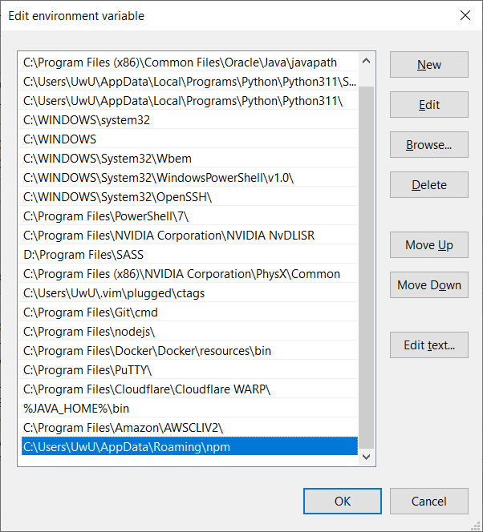

# Setup Firebase Server - Gitlab CI/CD

Created time: June 18, 2023 11:31 PM
Last edited time: June 21, 2023 9:48 AM
Owner: Phương Hữu
Tags: Wiki

# How to Set Up Firebase and Gitlab CI/CD for Your Project

## Introduction

Firebase and Gitlab are two powerful tools for web developers. Firebase is a platform that offers various backend services, such as authentication, storage, and hosting, while Gitlab is a web-based Git repository manager that provides continuous integration and continuous deployment (CI/CD) features. Combining the two can make your development process faster, more efficient, and more automated. In this blog post, we will discuss how to set up Firebase and Gitlab CI/CD for your project.

## Install Firebase CLI

Before setting up Firebase, you need to install the Firebase command-line interface (CLI) on your local machine. You can do this by running the following command in your terminal:

```bash
npm install -g firebase-tools
```

## Login with Your Account

Next, you need to log in to your Firebase account via the CLI. Run the following command in your terminal:

```bash
# This will direct to Google Login
firebase login:ci
```

This will generate a token that you can use to authenticate your Gitlab CI/CD pipeline.

## Copy the Token and Parse It in Your Gitlab CI/CD Variables

After generating the token, copy it and add it as a variable in your Gitlab CI/CD pipeline. To do this, go to your project's settings, select "CI/CD," and then "Variables." Add a new variable called "FIREBASE_TOKEN" and paste the token that you copied.

## Set Up Your Firebase Project

To set up your Firebase project, you need to create a cloud Firestore project and a functions codebase. Run the following commands in your project's root directory to create these:

```bash
# This will set up a firestore project
firebase init firestore

# This will set up a function codebase
firebase init functions
```

These commands will create the necessary files and directories in your project's root directory. Your folder structure will look like this:

```
myproject
+- .firebaserc
|
+- firebase.json
|
+- functions/
      |
      +- index.js
      |
      +- node_modules/

```

The `.firebaserc` file is a hidden file that helps you quickly switch between projects with `firebase use`. The `firebase.json` file describes properties for your project. The `functions/` directory contains all your functions code, including the `index.js` file, which is the main source file for your Cloud Functions code.

You also need to set up your `firebase.json` file and `index.js` file.

In the `firebase.json` file, you need to set up your hosting, Firestore rules and indexes, and Cloud Functions. Here's a sample `firebase.json` file:

```json
{
  "hosting": {
    "public": "public",
    "ignore": ["firebase.json", "**/.*", "**/node_modules/**"]
  },
  "firestore": {
    "rules": "firestore.rules",
    "indexes": "firestore.indexes.json"
  },
  "functions": [
    {
      "source": "functions",
      "codebase": "default",
      "ignore": [
        "node_modules",
        ".git",
        "firebase-debug.log",
        "firebase-debug.*.log"
      ],
      "runtime": "nodejs20"
    }
  ],
  "rewrites": [
    {
      "source": "**",
      "function": "App"
    }
  ]
}

```

In the `index.js` file, you need to set up your Cloud Functions code. Here's a sample `index.js` file:

```jsx
import express from "express";
...
import * as functions from "firebase-functions";
const app = express();
...
const App = functions.https.onRequest(app);

export default App;

```

It must export via es6 since we’re using .js format, if this doesn’t suit you, please use commonjs.

## Set up Environment Variable

In order to deploy via Gitlab CI/CD, you must set npm location in Environment variables in Path System variables, if not your Firebase CLI won’t recognize that you have installed firebase cli and will throw error.



Here’s an Example of setting Environment

## Set Up Gitlab CI/CD

To set up Gitlab CI/CD, create a `.gitlab-ci.yml` file in your project's root directory. In this file, you need to define the deploy stage and set up your deployment rules. Here's a sample `.gitlab-ci.yml` file:

```yaml
stages:
  - deploy

deploy_server:
  stage: deploy
  image: node:latest
  # Set up cache
  cache:
    key: "$CI_PIPELINE_ID"
    paths:
      - node_modules/
  before_script:
    # This will move to your functions folder and install its dependencies
    - cd functions
    - npm install
    # This will move out to your project folder
    - cd ..
    # This will install firebase cli
    - npm install -g firebase-tools
    # This will kill the port if it's accidentally running
    # I use port 5000 in this scenario
    - npx kill-port 5000
  script:
    # Set up firebase
    - firebase use --clear
    - firebase use dev
    # Deploying firebase
    - firebase deploy --only functions --token "$FIREBASE_TOKEN"
    - exit 0
    - echo "Deploying server successfully!!!"
  # Set up rule trigger when server branch is committed
  rules:
    - if: '$CI_COMMIT_REF_NAME == "server"'
      when: always

```

This file defines the `deploy` stage and the `deploy_server` job. The `image` field specifies the Docker image to use for the job. The `cache` field specifies the cache key and paths to cache. The `before_script` field specifies the commands to run before the script. The `script` field specifies the commands to run during the script. The `rules` field specifies the rules for triggering the job.

## Conclusion

Setting up Firebase and Gitlab CI/CD for your project can seem daunting at first, but it is a powerful combination that can streamline your development process. By following the steps outlined in this blog post, you can easily set up Firebase and Gitlab CI/CD for your project and take advantage of their many benefits. With Firebase, you can use powerful backend services like authentication, storage, and hosting. With Gitlab, you can manage your codebase and automate your development process with CI/CD. Together, they can make your development process faster, more efficient, and more automated.